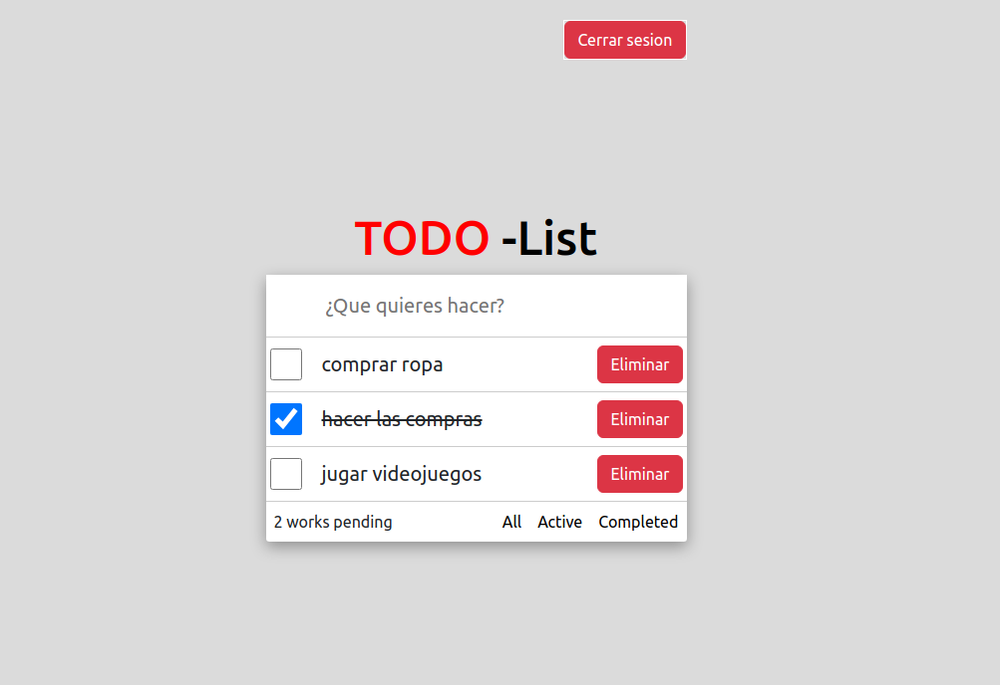

# Todo-List - React

Este proyecto es una aplicacion donde podras controlar tus tareas
mediante un inicio de sesion para que especificamente solo veas
las que te pertenecen, incluye las acciones de agregar, filtrar e incluso irlas 
eliminando para que no se te acumulen

## Requisitos

- Node.js (v18 o superior)
- npm (normalmente se intala con Node.js)

## Instalacion

```bash
git clone https://github.com/GuarU345/pokedex_react.git
```

```bash
cd nombre-del-proyecto
```

```bash
npm install
```

```bash
npm run dev
```

## Caracteristicas

- Inicio de sesion: Registrate e inicia sesion para que puedas empezar a 
registrar tus tareas
- Lista de Tareas: Visualiza la informacion de las tareas que vayas creando
- Filtros: Visualiza las tareas que ya estan terminadas y las que aun no estan
finalizadas
- Acciones: Eliminar y finalizar tareas

# Imagenes del proyecto



## Contribuciones

- Crea un fork del repositorio
- Crea una nueva rama para tus cambios: `git checkout -b nueva-caracteristica`
- Realiza tus cambios y haz commit: `git commit -m "añade nueva caracteristica`
- Envia tus cambios: `git push origin tu-rama`

## Contacto

Si tienes alguna pregunta o sugerencia, no dudes en ponerte en contacto conmigo
en [abelmtz34@outlook.com] o con mi perfil de github GuarU345.

¡Gracias por utilizar mi proyecto!